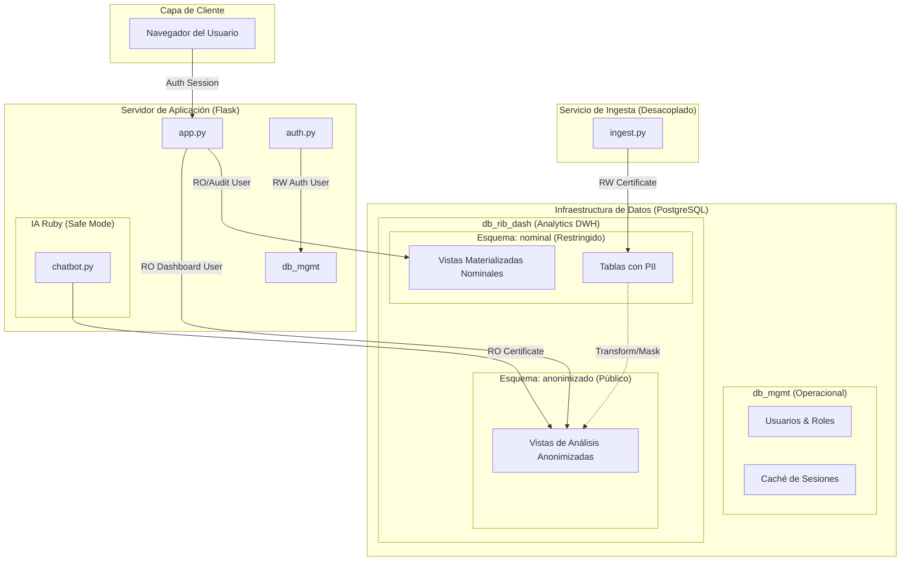

# Arquitectura Refactorizada (Estado Futuro)

Este diagrama representa el diseño objetivo del sistema **RIB Dashboard**, optimizado para seguridad crítica, aislamiento de datos nominales y simplicidad de mantenimiento para ~100 usuarios.

## Cambios Clave en la Arquitectura

1.  **Doble Persistencia**: Las sesiones y usuarios se gestionan en una base de datos operativa ligera (`db_mgmt`), aislándolas del volumen y riesgo de los datos de beneficiarios.
2.  **Aislamiento de PII mediante Roles**:
    *   El **Usuario de Dashboard** solo tiene acceso al esquema `anonimizado`. Físicamente no puede realizar una `JOIN` o `SELECT` sobre el esquema `nominal`.
    *   El **Usuario de Auditoría** accede al esquema `nominal` a través de un pool de conexiones segregado con certificados específicos.
3.  **Seguridad por Capas (mTLS)**: Cada interacción entre Flask y las bases de datos utiliza certificados mTLS específicos para el rol que se está ejecutando, minimizando el radio de explosión en caso de compromiso del servidor.
4.  **Chatbot Confinado**: El motor de IA "Ruby" queda estrictamente confinado al esquema `anonimizado`, eliminando cualquier posibilidad de exfiltración de PII a través de "vulnerabilidades de prompt" o SQL Injection indirecto.

---
**Documento de Diseño Objetivo para RIB Dashboard Architecture Refactoring**
