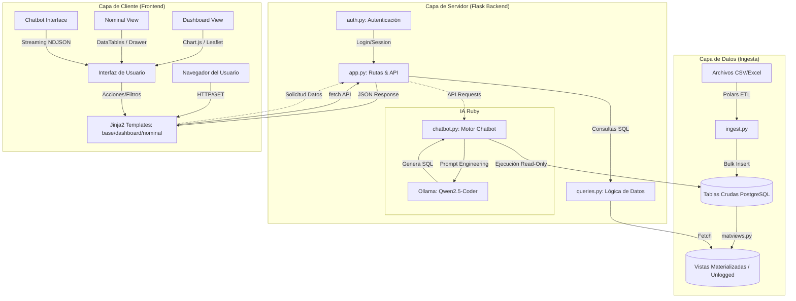

# Arquitectura y Flujo de Datos End-to-End

Este diagrama describe el funcionamiento integral del sistema **RIB Dashboard**, abarcando desde la ingesta de datos en bruto hasta la visualización en el frontend y la interacción con la IA.

## Descripción del Flujo

1.  **Ingesta**: El proceso comienza en `ingest.py`, que utiliza **Polars** para procesar archivos masivos y cargarlos en PostgreSQL. Luego, `matviews.py` transforma estos datos en tablas optimizadas para lectura rápida.
2.  **Autenticación**: `auth.py` gestiona el acceso mediante sesiones (actualmente del lado del cliente). Solo usuarios autenticados pueden acceder a las rutas de `app.py`.
3.  **Consumo de API**: El frontend (Jinja2 + JS Vanilla) realiza peticiones `fetch` a endpoints de indicadores. `queries.py` traduce estas peticiones en SQL eficiente que consulta las vistas materializadas.
4.  **Visualización**: Los datos se renderizan dinámicamente usando **Chart.js** para gráficos, **Leaflet** para el mapa de Argentina y componentes custom para la vista nominal.
5.  **Interacción IA**: Cuando el usuario consulta a "Ruby", `chatbot.py` interactúa con un modelo local (**Ollama**) para generar SQL. Este SQL se ejecuta bajo restricciones estrictas de "solo lectura" para devolver resultados estructurados al chat.

---
**Generado para RIB Dashboard Architecture Audit**
